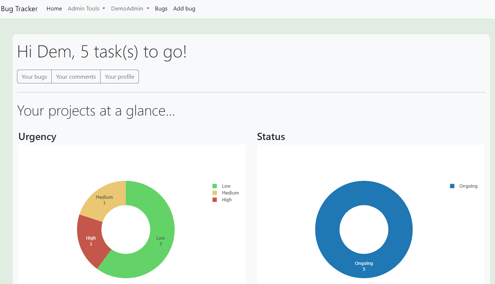

# Bug Tracker
https://aqbugtracker.pythonanywhere.com/

Bug tracker app written in Python, HTML, and Javascript. Uses Flask and SQLAlchemy.

# Repository Description:



This is a Python-based web application that helps users track bugs, powered by Flask. 
This application allows a software development team to monitor and report on errors that occur as an application is developed.  
Users who register and log in are able to raise bugs to the SQL lite powered database, and assign users to it. 
Each bug is given its own page, where users can add comments, giving an update to the progress of the bug.
Each user is given their own personal homepage that displays graphically their ongoing tasks.
Admins are given the ability to edit user details, see overall statistics of the entire database, as well as bugs and comments.

# Project Organization:

The project consists of the following directories and files:

```
├── tracker/ 
│   ├── static/
│   │   ├── css/
│   │   │   └── styles.css
│   │   └── images/
│   ├── templates/
│   │   ├── add_bug.html
│   │   ├── admin_edit_password.html
│   │   ├── admin_edit_user.html
│   │   ├── bug_profile.html
│   │   ├── edit_bug.html
│   │   ├── edit_comment.html
│   │   ├── header.html
│   │   ├── home.html
│   │   ├── index.html
│   │   ├── login.html
│   │   ├── navbar.html
│   │   ├── register.html
│   │   ├── statistics.html
│   │   ├── user_comments.html
│   │   ├── user_edit_password.html
│   │   ├── user_profile.html
│   │   └── users.html
│   ├── __init__.py
│   ├── forms.py
│   ├── models.py
│   ├── routes.py
├── instance/
│   └── bug_tracker.db
├── requirements.txt
└── run.py
```

tracker/: Contains the main source code for the web application, including routes, forms, and templates.

instance/: Contains SQL lite database for the application.

requirements.txt: Lists the required packages and dependencies for the application.

run.py: The entry point for the application.

# First Time Set-up:

1. Clone the repository:

```$ git clone https://github.com/AntonyQuang/Bug-Tracker.git```

2. Create a virtual environment and activate it:

```$ python3 -m venv env 
$ source env/bin/activate`
```
3. Install the required packages:

```$ pip install -r requirements.txt```

4. Set up your individual .env file which contains:
 - Your Flask Secret Key
 - Your SQL Alchemy database uri

5. Set up the database:

```
$ export FLASK_APP=run.py
$ flask db init
```
6. Run the application:

```  $ flask run```

# Persistent Environments:

This application uses a SQLite database by default. To switch to a different database, update the SQLALCHEMY_DATABASE_URI in \_\_init\_\_.py.

# Deployment:

The application can be deployed to a production environment using a web server such as Gunicorn or uWSGI.

# Code Style and Standards:

This project follows the PEP 8 (python.org/dev/peps/pep-0008/) coding style guidelines.

# License Information:

This project is licensed under the MIT License (opensource.org/licenses/MIT).

# Status and Roadmap

The application is currently in a functional state, but there is still room for improvement and new features to be added. The project roadmap includes transferring the database to a PostgreSQL database format, improving the website scalability, and integrating email functions.
